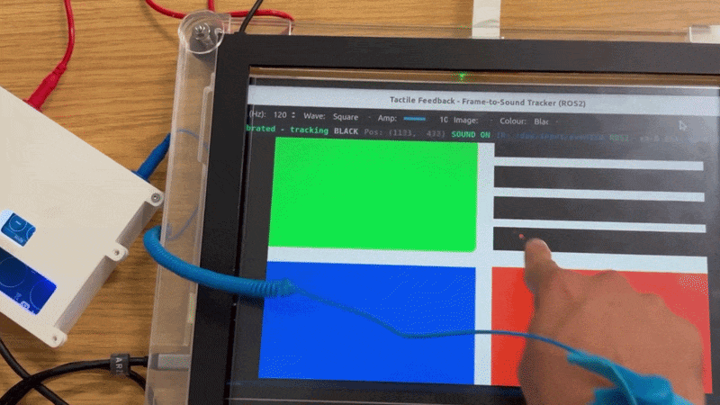
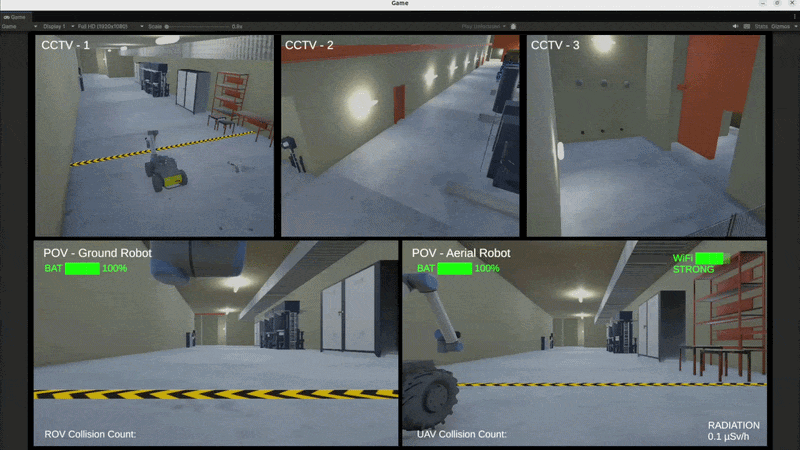
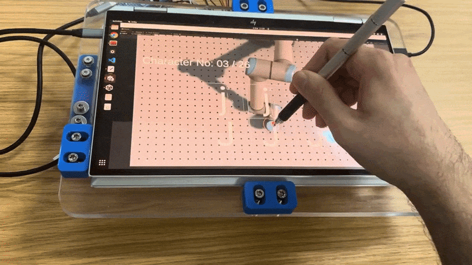
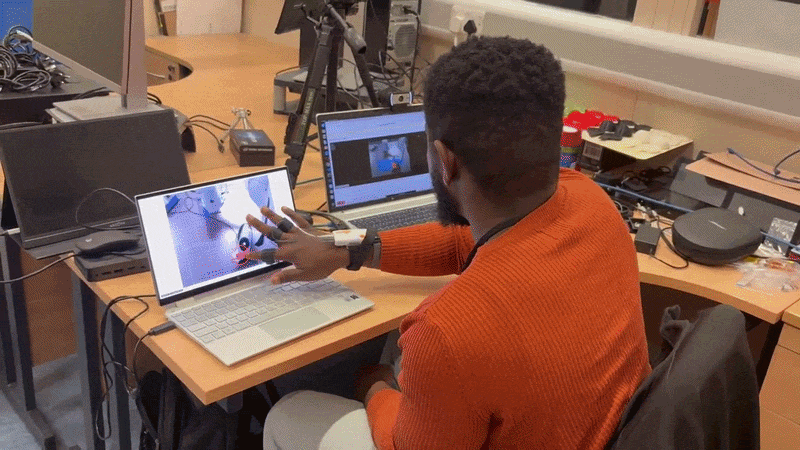
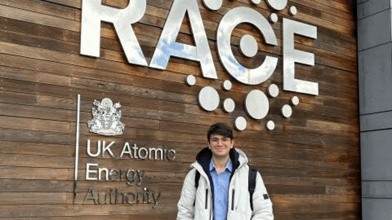
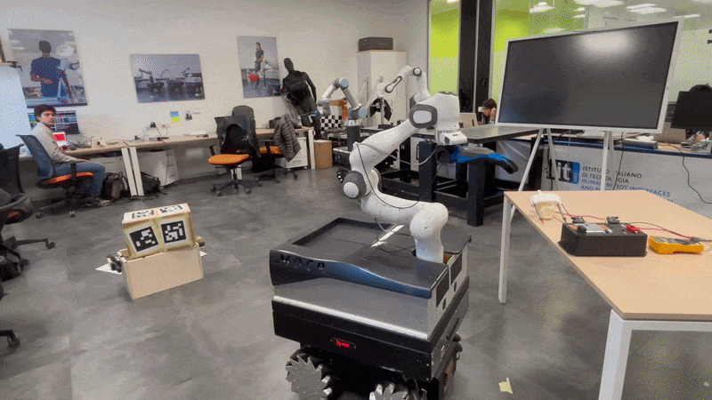
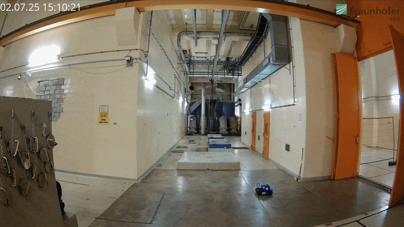
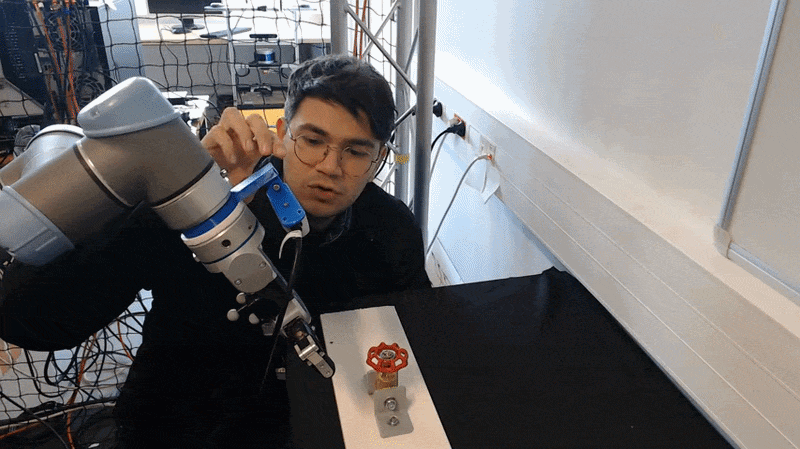

# Alperen Kenan

### Robotics Engineer · Human-Robot Interaction · Teleoperation · Haptics

I build human-centred robotic systems that connect **people, robots and real-world environments** through sensing, feedback and control.

---

## 👋 About Me

I am a **Robotics Engineer and PhD Researcher** working at the intersection of **Human-Robot Interaction (HRI), teleoperation, haptics, robot learning and control**. My research focuses on closing the loop between human operators and robots through intuitive interfaces, real-time feedback and user-centred design.

My doctoral research at the **Bristol Robotics Laboratory** focuses on teleoperation interfaces for hazardous nuclear environments, including touchscreen-based electrovibration feedback, remote manipulation and multi-operator, multi-robot systems. Alongside this work, I investigate how robots can learn motion from human demonstrations and how learned behaviour can be evaluated for human-likeness.

I am particularly interested in research that moves beyond simulation: **design → build → test with people → validate on real robotic systems**.

### Research interests

`Human–Robot Interaction` · `Robot Teleoperation` · `Haptics` · `Robot Learning from Demonstration` · `Trajectory Learning` · `Control` · `Digital Twins` · `Interface Design` · `Mechatronics`

---

## 🔬 Research & Projects

The projects below represent the main themes of my current research. The animated previews are taken directly from the corresponding project demonstrations and publications.

<table>
<tr>
<td width="50%" valign="top">

### 🖐️ Tactile Teleoperation

**Electrovibration-based tactile feedback for touchscreen robot teleoperation.**

Designing interfaces that allow operators to perceive remote contact through a touchscreen, with applications in hazardous and nuclear environments.

**Publication:** *Remote Surfaces at Your Fingertips* — IEEE Telepresence 2026

[Publication / repository](https://zenodo.org/records/21740617)

</td>
<td width="50%" valign="top">

### 🤖 Multi-Robot Teleoperation

**Collaborative control of multiple robots by multiple operators.**

Developing interfaces and interaction strategies for coordinated teleoperation in challenging environments where workload, awareness and communication are critical.

**Publication:** *Design and Evaluation of a Collaborative Teleoperation Interface for Multi-Operator Multi-Robot Systems* — IEEE Telepresence 2026

[Publication / repository](https://zenodo.org/records/21740502)

</td>
</tr>
<tr>
<td width="50%" valign="top">

### ✍️ Robot Learning from Demonstration

**Learning handwritten trajectories from human demonstrations.**

A dataset and learning pipeline for human handwriting trajectories, including position, force and timing, with evaluation of the human-likeness of generated robot motion.

**Publication:** *Robot Learning from Human Demonstrations: Handwritten Alphabet Trajectories and Human-Likeness Evaluation* — IEEE ICDL 2026

[Preprint](https://arxiv.org/abs/2608.06221) · [Dataset](https://github.com/kenanalperen/Trajectory-and-Force-Data-for-Handwritten-Alphabet-Generation)

</td>
<td width="50%" valign="top">

### 👆 Touchscreen Robot Interfaces

**Designing and evaluating touchscreen-based robot teleoperation.**

Investigating how touchscreen interaction can support intuitive robot manipulation, including user-centred design, interaction techniques and evaluation with human participants.

**Publication:** *Design and Evaluation of a Touchscreen-Based Teleoperation Interface for Robotic Manipulators* — IEEE RO-MAN 2026

[Preprint](https://arxiv.org/abs/2608.06219)

</td>
</tr>
<tr>
<td width="50%" valign="top">

### ☢️ Nuclear Robot Teleoperation

**Human-centred teleoperation for hazardous environments.**

Working with end users and industry stakeholders to identify requirements for robot interfaces used in nuclear facilities, with a focus on operator workload, situational awareness and safe interaction.

**Publication:** *Robot Teleoperation Design Requirements from End Users in Nuclear Facilities* — IEEE/RSJ IROS 2025

[DOI](https://doi.org/10.1109/IROS60139.2025.11246717)

</td>
<td width="50%" valign="top">

### 🌐 RAICAM Research

**Robotics research across a European doctoral network.**

Research sprints, field demonstrations and collaborative robotics research conducted across an international network spanning academia and industry.

**Publication:** *Lessons Learned from the RAICAM Doctoral Network Research Sprints and Field Demonstrations* — Robotics and Autonomous Systems

[DOI](https://doi.org/10.1016/j.robot.2026.105523)

</td>
</tr>
<tr>
<td width="50%" valign="top">

### 🧑‍🔬 Nuclear Inspection Robotics

**Rapid-development robotic systems for nuclear inspection.**

Contributing to low-cost air-ground robotic solutions for inspection tasks in nuclear power plant environments.

**Publication:** *Low-Cost Rapid-Development Air-Ground Robotic Solution for Nuclear Power Plant Inspection* — IEEE SSRR 2025

[DOI](https://doi.org/10.1109/SSRR68451.2025.11391258)

</td>
<td width="50%" valign="top">

### 🎮 Human-Centred Robot Control

**From user requirements to deployable robotic interfaces.**

My broader research explores how interaction design, tactile feedback, robot learning and control can be combined to make complex robotic systems more intuitive and effective for human operators.

</td>
</tr>
</table>

---

## 📚 Publications

### Published / Accepted

1. **Kenan, A., Bremner, P., & Giuliani, M.** *Robot Teleoperation Design Requirements from End Users in Nuclear Facilities.* IEEE/RSJ IROS 2025. [DOI](https://doi.org/10.1109/IROS60139.2025.11246717)
2. **Kenan, A. et al.** *Lessons Learned from the RAICAM Doctoral Network Research Sprints and Field Demonstrations.* Robotics and Autonomous Systems, 2026. [DOI](https://doi.org/10.1016/j.robot.2026.105523)
3. **Kenan, A. et al.** *Lessons Learned from the RAICAM Doctoral Network Research Sprints.* TAROS 2025, Springer LNCS. [DOI](https://doi.org/10.1007/978-3-032-01486-3_40)
4. **Tian, C. et al., including Kenan, A.** *Low-Cost Rapid-Development Air-Ground Robotic Solution for Nuclear Power Plant Inspection.* IEEE SSRR 2025. [DOI](https://doi.org/10.1109/SSRR68451.2025.11391258)
5. **Kenan, A. et al.** *Robot Learning from Human Demonstrations: Handwritten Alphabet Trajectories and Human-Likeness Evaluation.* IEEE ICDL 2026. [arXiv](https://arxiv.org/abs/2608.06221)
6. **Cárdenas, J. J. G. et al., including Kenan, A.** *Design and Evaluation of a Touchscreen-Based Teleoperation Interface for Robotic Manipulators.* IEEE RO-MAN 2026. [arXiv](https://arxiv.org/abs/2608.06219)
7. **Kenan, A. et al.** *Remote Surfaces at Your Fingertips: Electrovibration-Based Tactile Feedback for Robot Teleoperation via Touchscreen Interfaces.* IEEE Telepresence 2026. [Zenodo](https://zenodo.org/records/21740617)
8. **Kenan, A. et al.** *Design and Evaluation of a Collaborative Teleoperation Interface for Multi-Operator Multi-Robot Systems in Challenging Environments.* IEEE Telepresence 2026. [Zenodo](https://zenodo.org/records/21740502)

### In preparation

- *User-Centred Design of a Touchscreen Teleoperation Interface for Remote Swab Sampling Tasks in Nuclear Environments.* Target: Journal of Field Robotics.
- *User-Centred Design of a Multi-Operator Teleoperation Interface for Coordinated Multi-Robot Tasks in Nuclear Environments.* Target: Journal of Field Robotics.

---

## 🎓 Education & Experience

**PhD in Robotics Engineering** · University of the West of England / Bristol Robotics Laboratory · 2023–2026

Marie Skłodowska-Curie Actions Doctoral Fellow within the **RAICAM Horizon Europe Doctoral Network**. Thesis: *User-Centred Design of Robot Teleoperation Interfaces for Nuclear Environments: Swab Sampling and Multi-Operator Multi-Robot Systems*.

**Graduate Exchange Student** · TU Delft · 2022–2023

**BSc Mechanical Engineering** · Middle East Technical University · 2016–2022

**Minor in Aerospace Engineering** · Middle East Technical University · 2020–2022

### Research positions

- Research Associate · University of Bristol · 2025–Present
- Research Associate · University of the West of England · 2023–Present
- Visiting Researcher · ENSTA Paris / TUM / IIT / RAICo1 · 2024–2026
- Lab Intern · TU Delft Haptic Interface Technology Lab · 2022–2023
- Graduate Researcher · Sabancı University · 2021–2023

---

## 🛠️ Technical Toolkit

| Area | Experience |
|---|---|
| **Programming** | Python · C++ · C# · MATLAB |
| **Robotics** | ROS 2 · ROS 1 · Docker · Franka manipulators |
| **Control** | Simulink · Simulink Real-Time · Beckhoff TwinCAT |
| **Haptics** | Electrovibration · Tactile feedback · Human-in-the-loop systems |
| **Simulation** | Digital twins · Gazebo · Isaac Sim |
| **Engineering** | SolidWorks · Siemens NX · Arduino · Electronics |

---

## 🌍 Beyond the Lab

- **Demonstration Lead Chair**, IEEE Telepresence 2026
- **Special Session Committee Member**, TAROS 2025
- **Lead Dissertation Supervisor**, 2 MSc students
- **Science Communicator**, Science is Wonderful! MSCA Science Fair, Brussels
- **Participant**, European Robotics Hackathon (EnRicH), Austria
- **International secondments** across France, Germany, Italy, the Netherlands and the UK

---

## 🔗 Find Me Online

> **Interested in human-centred robotics, teleoperation, haptics or robot learning?**
> 
> Feel free to get in touch for research collaboration, discussion or opportunities.

📧 **Alperen.Kenan@uwe.ac.uk**

---

*Last updated: September 2026*
